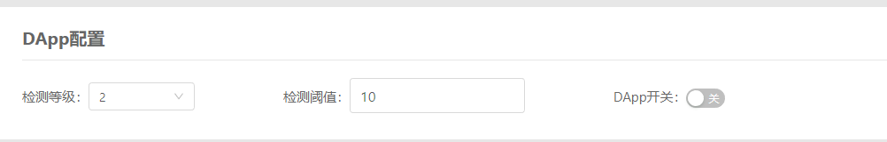
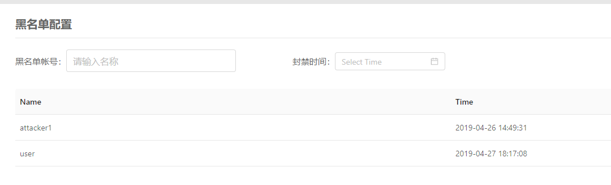
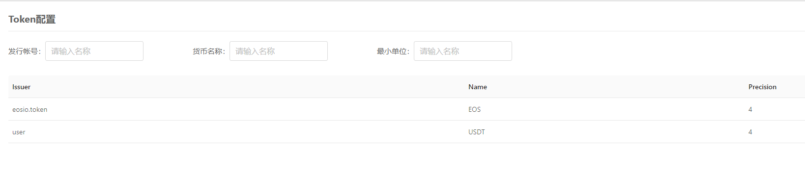
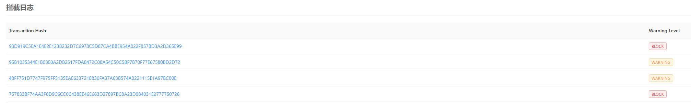
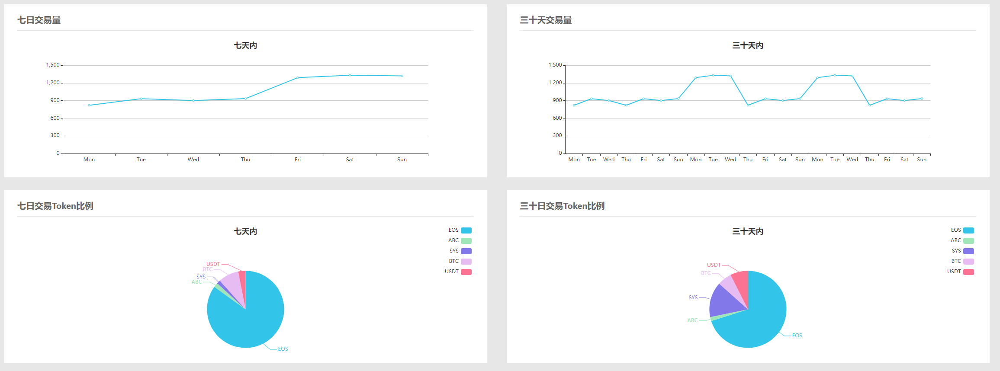

## EOSDAppGuard ##


### 0x00 简介 ###

`EOSDappGuard`是一款基于`EOS`的`DApp(智能合约)安全卫士`，可以帮助开发者抵御黑客的攻击，方便开发者对DApp的运行状态进行管理，方便开发者查看DApp的运行状态，还可抵御羊毛党薅DApp活动的羊毛


### 本地测试 ###

1. 创建合约帐号

```bash
cleos create account eosio eosdappguard EOSxxxxxxxxxxxxx EOSxxxxxxxxxxxxx 
```

2. 部署`DApp安全卫士`

```bash
cleos set code eosdappguard eosdappguard.wasm
cleos set abi eosdappguard eosdappguard.abi
```

3. 配置`DApp安全卫士`权限

```bash
cleos set account permission eosdappguard active '{"threshold": 1,"keys": [{"key": "EOSxxxxxxxxxxxxx","weight": 1}],"accounts":[{"permission":{"actor":"eosdappguard","permission":"eosio.code"},"weight":1}]}' owner -p eosdappguard@owner
```

4. 初始化`DApp安全卫士`

```bash
cleos push action eosdappguard initguard '[""]' -p eosdappguard
```


### DApp接入 ###

1. 引用`sdk`

```c++
// 定义EOSDAPPGUARD的账号
#define EOSDAPPGUARD "eosdappguard"_n
// 引入sdk
#include "guard.hpp"
using namespace eosio;
using namespace guard;
```

2. 在`DApp`入口进行检测

```c++
[[noreturn]] void apply(uint64_t receiver, uint64_t code, uint64_t action)
{
    ...    
	auto dappguard = guard::eosdappguard(name(receiver), name(code), ds);
	auto warning_level = dappguard.checktx();

	switch(warning_level){
		case EOSDAPPGUARD_BLOCK:
			dappguard.logging(warning_level);
			eosio_exit(0);
			break;
		case EOSDAPPGUARD_WARNING:
			dappguard.logging(warning_level);
			break;
	}
    ...
}
```


### 控制台使用 ###

1. 管理DApp状态

用户可以对DApp安全卫士进行设置，包括关闭DApp、DApp安全卫士检测等级和DApp安全卫士检测阈值。



2. 用户自定义黑名单

用户可自定义DApp的黑名单账号，以及封禁时间。可以阻止名单内的账号访问DApp，在一定程度上提高了攻击者的攻击成本，保护了DApp的资产不受损失。



3. 自定义Token白名单

DApp开发者可以自定义允许交易的Token白名单，防止黑客使用假币进行攻击。



4. DApp告警日志日志

DApp开发者可以在管理界面查看DApp安全卫士的告警日志，BLOCK即为拦截的事务，WARNING为告警未拦截的事务。



5. DApp运行状态

在DApp安全卫士的管理界面可以查看接入DApp相关的信息




### 联系我们 ###

联系邮箱：

support@noneage.com

如有任何疑问请联系邮箱

[联系我们](mailto:support@noneage.com)

[telegram](t.me/eosdappguard)